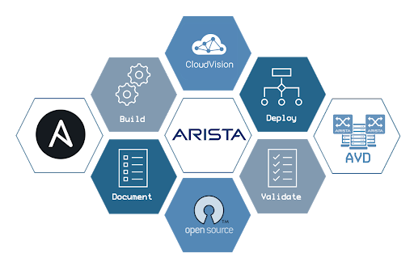

 

# Ansible AVD & CVP TOI Labs

## About

This repository is part of the [Arista Netdevops Community](https://github.com/arista-netdevops-community) and provides lab material that is using [`arista.cvp`](https://github.com/aristanetworks/ansible-cvp) & [`arista.avd`](https://github.com/aristanetworks/ansible-avd) ansible collections. It contains lab playbooks and jinja templates.

<p align="center">
  
</p>

## List of available labs

- Ansible Basics:
  - _Lab 01_: [Ansible Basics](labs/lab01-ansible-basics)
  - _Lab 02_: [Ansible Template Management](labs/lab02-ansible-template-mgt)

- Ansible & CloudVision:

  - _Lab 03_: [CloudVision Collection Overview](labs/lab03-arista.cvp-overview)
  - _Lab 04_: [Configlets](labs/lab04-cv-configlets)
  - _Lab 05_: [Containers](labs/lab05-cv-containers)
  - _Lab 06_: [Devices](labs/lab06-cv-device)
  - _Lab 07_: [Tasks](labs/lab07-cv-tasks)


- Arista Validated Design:
  - _Lab 08_: [L3ls Evpn Fabric Description](labs/lab08-avd-l3ls-evpn)
  - _Lab 09_: [Eos CLI Gonfiguration Generation](labs/lab09-avd-eos-cli-config-gen)
  - _Lab 10_: [Eos Configuration Deployment](labs/lab10-avd-eos-config-deploy)
  - _Lab 11_: [Eos State Validation](labs/lab11-avd-eos-state-validate)
  - _Lab 12_: [Eos Configuration Generation Role Extension](labs/lab12-avd-eos-config-gen-extension)


## Getting Started

```shell
# Clone repository
$ git clone https://github.com/arista-netdevops-community/ansible-cvp-avd-toi.git

# Move to directory
$ cd ansible-cvp-avd-toi

# Move to lab folder
$ cd labs

# Edit inventory file
$ vi inventory.yml
```

## Configure Lab Environment

- [Arista Test Drive (ATD)](docs/atd-setup.md) for lab environment
- [Virtual Environment](docs/venv-setup.md)

## Resources

- [Arista Ansible AVD Collection](https://github.com/aristanetworks/ansible-avd)
- [Arista Cloudvision Collection](https://github.com/aristanetworks/ansible-cvp)
- [AVD & CVP Collections demo](https://github.com/arista-netdevops-community/ansible-avd-cloudvision-demo)

## License

Project is published under [Apache License]().

<p align="center">
  
</p>
